## 1. 产品概述

知识花园（Knowledge Garden）是一个沉浸式的个人知识管理与可视化工具，用户可以在无限延伸的画布上种植"知识节点"，构建个性化的知识图谱。通过力导向布局算法让关联紧密的知识自动聚集成团，帮助用户发现知识之间的隐藏联系。

- 核心目标：帮助知识工作者（学生、研究者、创作者）以可视化、游戏化的方式整理和探索个人知识体系，突破传统线性笔记的局限。
- 市场价值：填补思维导图工具（结构化但局限）与笔记工具（灵活但无序）之间的空白，提供兼具美感与实用性的知识可视化体验。

## 2. 核心功能

### 2.1 用户角色
| 角色 | 注册方式 | 核心权限 |
|------|---------|---------|
| 个人用户 | 无需注册，本地使用 | 创建/编辑/删除节点，导入导出数据 |

### 2.2 功能模块
1. **主画布页面：无限画布、节点渲染、连线系统、力导向布局、缩放平移、缩略图导航
2. **节点编辑器面板：6种节点形态创建与编辑
3. **时间轴视图：按时间排列所有节点
4. **筛选与标签面板：多维度筛选、颜色编码
5. **专注模式：高亮关联节点，淡化其余
6. **数据管理：LocalStorage 持久化、JSON 导出、静态 HTML 分享

### 2.3 页面详情
| 页面名称 | 模块名称 | 功能描述 |
|---------|---------|---------|
| 主画布 | 无限画布 | 支持鼠标/触摸拖拽平移，滚轮缩放（0.1x - 5x），右下角缩略图导航 |
| 主画布 | 节点系统 | 6种节点：文本卡片、代码片段、图片画廊、网页书签、音频备忘录、思维导图分支 |
| 主画布 | 连线系统 | 支持多种连线类型：关联、因果、引用、分支；贝塞尔曲线渲染 |
| 主画布 | 力导向布局 | 自动布局、节点聚团、拖拽锁定、物理模拟 |
| 主画布 | 节点编辑器 | 弹窗编辑节点内容、标签、颜色、类型切换 |
| 时间轴视图 | 时间线排列 | 按创建/修改时间线性排列，支持时间段过滤 |
| 筛选面板 | 标签筛选 | 多选标签、颜色过滤、类型过滤、关键词搜索 |
| 专注模式 | 关联高亮 | 选中节点后，高亮 1-2-3 跳关联，其余淡化 |
| 数据管理 | 导入导出 | LocalStorage 自动保存，导出 JSON，生成可分享 HTML |

## 3. 核心流程

### 主要用户流程
用户打开应用 → 检查本地数据加载 → 在画布空白处双击创建节点 → 选择节点类型 → 编辑内容 → 添加标签与颜色 → 拖拽调整位置 → 连接其他节点建立关联 → 开启力导向布局自动整理 → 使用时间轴视图回顾 → 导出分享

```mermaid
flowchart TD
    A["打开应用"] --> B["加载本地数据"]
    B --> C["展示知识画布"]
    C --> D{"用户操作"}
    D -->|双击空白处| E["创建节点"]
    D -->|点击节点| F["编辑/专注"]
    D -->|拖拽连线| G["建立关联"]
    E --> H["选择节点类型"]
    H --> I["编辑内容与标签"]
    I --> J["保存到 LocalStorage"]
    F --> K["专注模式高亮关联"]
    G --> L["力导向自动布局"]
    C --> M["切换时间轴视图"]
    C --> N["筛选面板筛选节点"]
    C --> O["导出/分享"]
    O --> P["JSON 导出"]
    O --> Q["生成静态 HTML"]
```

## 4. 用户界面设计

### 4.1 设计风格
- **主色调**：深绿/深林绿色调 - 象征生长与自然，配合柔和的渐变
  - 主色：#10b981（Emerald-500）
  - 背景：#0f172a（Slate-900）
  - 辅助：#1e293b（Slate-800）
  - 强调色1：#f59e0b（琥珀-500）
  - 强调色2：#ec4899（粉红-500）
- **节点配色方案**：
  - 背景采用深色模式为主，配合柔和的发光效果模拟花园氛围
  - 节点采用柔和渐变与光晕效果
- **按钮风格**：圆角胶囊形按钮，悬停时微妙发光，点击有按压动效
- **字体**：
  - 标题：Fraunces（优雅衬线）
  - 正文：JetBrains Mono（等宽）
- **布局风格**：
  - 无边界画布，网格背景（柔和点状网格营造深度感
  - 节点卡片采用玻璃拟态（Glassmorphism）效果
  - 半透明侧边抽屉式面板
- **图标风格**：Lucide 图标库，线性风格

### 4.2 页面设计概述
| 页面名称 | 模块名称 | UI 元素 |
|---------|---------|---------|
| 主画布 | 画布背景 | 深色渐变 + 柔和点状网格 + 微光粒子浮动动画 |
| 主画布 | 节点卡片 | 玻璃拟态卡片，渐变边框，悬浮阴影，拖拽时缩放动效 |
| 主画布 | 连线 | 贝塞尔曲线，渐变颜色，流动光效动画 |
| 主画布 | 缩略图 | 右下角，可拖拽视口，实时更新 |
| 侧边栏 | 工具面板 | 左侧垂直工具条，图标按钮，悬停展开提示 |
| 侧边栏 | 筛选面板 | 右侧滑出抽屉，标签云，颜色选择器 |
| 顶部栏 | 导航栏 | 顶部透明栏，视图切换，搜索框，导出按钮 |
| 时间轴 | 时间线 | 水平滚动，日期分组，节点缩略卡片 |
| 节点编辑器 | 弹窗 | 居中模态框，分栏布局，标签页切换 |

### 4.3 响应式
- 桌面端优先设计，支持 1280px 以上最佳体验
- 平板适配：侧边栏自动折叠为图标
- 移动端：画布全屏，面板改为底部滑出
- 触摸优化：双指缩放，长按拖拽

### 4.4 视觉氛围
- 环境：深夜花园主题，柔和的绿色与琥珀色点缀
- 光照：节点周围微弱光晕，选中时增强
- 动效：Framer Motion 实现流畅过渡，节点入场弹跳动画
- 粒子：背景微光粒子缓慢漂浮，营造沉浸感
- 深度：多层阴影与透明度过渡
