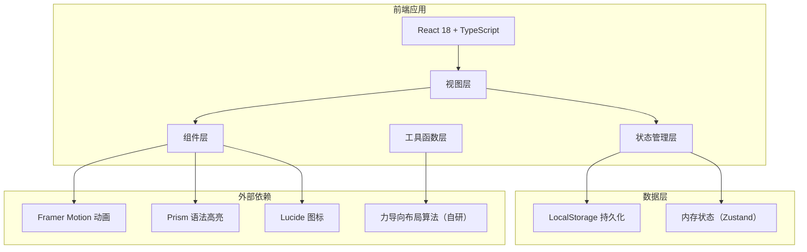

## 1. 架构设计



## 2. 技术描述
- 前端：React 18 + TypeScript 5 + Vite 5
- 样式：Tailwind CSS 3 + 自定义 CSS 变量
- 动画：Framer Motion 11
- 状态管理：Zustand 4
- 路由：React Router DOM 6（单页多视图切换）
- 语法高亮：PrismJS
- 图标：Lucide React
- 力导向布局：自研轻量级物理引擎
- 数据持久化：LocalStorage
- 音频处理：Web Audio API + MediaRecorder API
- 图片处理：Canvas API 压缩
- 代码高亮：PrismJS
- 初始数据：内置示例数据用于演示

## 3. 路由定义
| 路由 | 用途 |
|------|------|
| / | 主画布视图（默认） |
| /timeline | 时间轴视图 |

## 4. 核心模块划分

### 4.1 目录结构
```
src/
├── components/
│   ├── canvas/          # 画布相关组件
│   │   ├── Canvas.tsx              # 主画布容器
│   │   ├── CanvasBackground.tsx    # 背景网格与粒子
│   │   ├── MiniMap.tsx           # 缩略图导航
│   │   └── ViewportControls.tsx # 缩放控制
│   ├── nodes/           # 节点组件
│   │   ├── NodeRenderer.tsx       # 节点渲染器（分发）
│   │   ├── TextNode.tsx          # 文本卡片节点
│   │   ├── CodeNode.tsx          # 代码片段节点
│   │   ├── ImageNode.tsx         # 图片画廊节点
│   │   ├── BookmarkNode.tsx      # 网页书签节点
│   │   ├── AudioNode.tsx         # 音频备忘录节点
│   │   └── MindMapNode.tsx       # 思维导图节点
│   ├── connections/     # 连线组件
│   │   ├── ConnectionLayer.tsx    # 连线渲染层
│   │   └── Connection.tsx        # 单条连线
│   ├── editor/          # 编辑器组件
│   │   ├── NodeEditor.tsx         # 节点编辑弹窗
│   │   └── TagInput.tsx            # 标签输入
│   ├── layout/          # 布局算法
│   │   └── ForceLayout.ts          # 力导向布局
│   ├── panels/          # 面板组件
│   │   ├── Toolbar.tsx             # 左侧工具条
│   │   ├── FilterPanel.tsx         # 右侧筛选面板
│   │   ├── TopBar.tsx              # 顶部导航
│   │   └── TimelineView.tsx        # 时间轴视图
│   └── ui/              # 通用 UI 组件
│       ├── Button.tsx
│       ├── Modal.tsx
│       └── Badge.tsx
├── hooks/             # 自定义 Hooks
│   ├── useCanvas.ts            # 画布交互
│   ├── useForceLayout.ts      # 力导向布局
│   ├── useDragNode.ts         # 节点拖拽
│   └── useAudioRecorder.ts    # 录音
├── store/             # Zustand Store
│   └── useGardenStore.ts
├── types/             # TypeScript 类型
│   └── index.ts
│   └── node.ts
├── utils/             # 工具函数
│   ├── storage.ts            # LocalStorage
│   ├── image.ts              # 图片压缩
│   ├── export.ts             # 导出功能
│   └── colors.ts            # 颜色工具
├── pages/             # 页面
│   ├── GardenPage.tsx        # 主画布页
│   └── TimelinePage.tsx     # 时间轴页
└── App.tsx
└── main.tsx
```

## 5. 数据模型

### 5.1 数据模型定义

```mermaid
erDiagram
    KNOWLEDGE_NODE ||--o{ TAG : has
    KNOWLEDGE_NODE }o--o{ KNOWLEDGE_NODE : connected_to
    KNOWLEDGE_CONNECTION }o--|| KNOWLEDGE_NODE : from
    KNOWLEDGE_CONNECTION }o--|| KNOWLEDGE_NODE : to

    KNOWLEDGE_NODE {
        string id PK
        string type
        string title
        json content
        float x
        float y
        boolean locked
        string color
        datetime createdAt
        datetime updatedAt
    }

    TAG {
        string id PK
        string name
        string color
    }

    KNOWLEDGE_CONNECTION {
        string id PK
        string fromId FK
        string toId FK
        string type
        string label
    }
```

### 5.2 TypeScript 类型定义

```typescript
// 节点类型枚举
type NodeType = 'text' | 'code' | 'image' | 'bookmark' | 'audio' | 'mindmap';

// 连线类型
type ConnectionType = 'relation' | 'causal' | 'reference' | 'branch';

// 节点基类
interface KnowledgeNode {
  id: string;
  type: NodeType;
  title: string;
  content: NodeContent;
  x: number;
  y: number;
  locked: boolean;
  color: string;
  tags: string[];
  createdAt: number;
  updatedAt: number;
}

// 各类型节点内容
interface TextContent { text: string; }
interface CodeContent { code: string; language: string; }
interface ImageContent { images: ImageItem[]; }
interface ImageItem { id: string; url: string; thumbnail?: string; name: string; }
interface BookmarkContent { url: string; title?: string; description?: string; favicon?: string; }
interface AudioContent { audioUrl: string; duration?: number; waveform?: number[]; }
interface MindmapContent { branches: MindmapBranch[]; rootText: string; }
interface MindmapBranch { id: string; text: string; children?: MindmapBranch[]; }

type NodeContent = TextContent | CodeContent | ImageContent | BookmarkContent | AudioContent | MindmapContent;

// 连线
interface KnowledgeConnection {
  id: string;
  fromId: string;
  toId: string;
  type: ConnectionType;
  label?: string;
}

// 标签
interface Tag {
  id: string;
  name: string;
  color: string;
}

// 画布状态
interface CanvasState {
  zoom: number;
  offsetX: number;
  offsetY: number;
}

// 筛选条件
interface FilterState {
  selectedTags: string[];
  nodeTypes: NodeType[];
  searchText: string;
  dateRange: [number, number] | null;
}

// 全局状态
interface GardenState {
  nodes: KnowledgeNode[];
  connections: KnowledgeConnection[];
  tags: Tag[];
  canvas: CanvasState;
  filter: FilterState;
  selectedNodeId: string | null;
  focusMode: boolean;
  forceLayoutEnabled: boolean;
}
```

## 6. 核心实现策略

### 6.1 力导向布局算法
- 自研轻量级物理引擎
- 节点间斥力（库仑定律）
- 连线间引力（胡克定律）
- 中心引力防止漂移
- 速度阻尼防止震荡
- requestAnimationFrame 驱动
- 可暂停/启用，支持手动锁定节点

### 6.2 无限画布实现
- CSS transform: translate + scale
- 事件委托处理交互
- 虚拟坐标系统转换
- 缩略图实时同步

### 6.3 性能优化
- 节点懒渲染（视口裁剪）
- 连线离屏 Canvas 渲染
- 图片自动压缩（Canvas API）
- 音频 Web Worker 处理
- React.memo 组件 memo 优化
